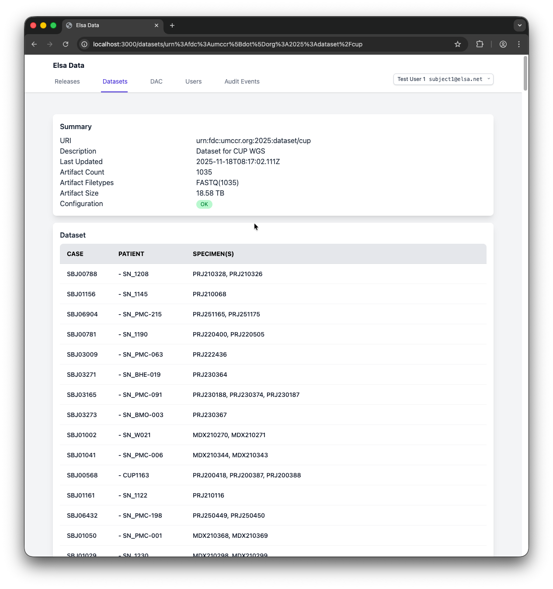

# Elsa Data Ingest OrcaBus

<!-- TOC -->
* [Elsa Data Ingest OrcaBus](#elsa-data-ingest-orcabus)
  * [Prerequisites](#prerequisites)
  * [Installation](#installation)
  * [Extract Module](#extract-module)
  * [Ingest Module](#ingest-module)
  * [Operation](#operation)
  * [Demo](#demo)
<!-- TOC -->


This project explores the ETL solution discussed in
the [slide](https://docs.google.com/presentation/d/1-k6hylxfyI_XmWUKCoBVlVTR_ohNEaMu/edit?slide=id.p1#slide=id.p1) which
is [presented](https://drive.google.com/file/d/1NhbhNCgd1w9dbdjRHs87l4vC30RQH_38/view?usp=drive_link) as part of GUARDIANS (https://www.biocommons.org.au/guardians) research project activity.

> Objective: A project to synchronise dataset objects that arrive off the Centre sequencing pipelines and have them
> automatically appear into a dataset registered in Elsa-Data.

## Prerequisites

* Consider you can run the Elsa Data stack. See [ELSA_DATA_LOCAL.md](ELSA_DATA_LOCAL.md)
* Consider you have access to the Data Warehouse service
  via [OrcaHouse](https://umccr.github.io/orcahouse-doc/) [Athena](https://umccr.github.io/orcahouse-doc/athena/)

```shell
node --version
v22.21.1

bun --version
1.3.2
```

## Installation

```shell
bun install
```

```shell
bun run gel --version
Gel CLI 7.8.0+a030e9f
```

```shell
bun run gel project init --no-migrations --link --server-instance backend
```

```shell
bun run gel project info
┌──────────────────┬───────────────────────────────────────────────┐
│ Database         │ (unavailable)                                 │
│ Instance name    │ backend                                       │
│ Project root     │ /Users/elsa/elsa-data-ingest-orcabus          │
│ Schema directory │ /Users/elsa/elsa-data-ingest-orcabus/dbschema │
└──────────────────┴───────────────────────────────────────────────┘
```

```shell
bun run gel instance list
┌───────┬─────────┬─────────────────┬─────────────┬─────────┐
│ Kind  │ Name    │ Location        │ Version     │ Status  │
├───────┼─────────┼─────────────────┼─────────────┼─────────┤
│ local │ backend │ localhost:10707 │ 7.0+6fea9be │ running │
└───────┴─────────┴─────────────────┴─────────────┴─────────┘
```

```shell
bun run geltypes
```

## Extract Module

* Consider you have set up AWS profile similarly to
  the [config](https://github.com/umccr/infrastructure/blob/master/scripts/all-accounts-aws-config.ini). Adjust
  otherwise.
* The extraction process intended to be idempotent. You can invoke many times and should expect the same outcome.

```shell
export AWS_PROFILE=umccr-prod-operator
```

```shell
bun run extract
```

## Ingest Module

* The ingest module currently perform Transform & Load together.
* The ingestion process intended to be idempotent. You can invoke many times and should expect the same outcome.

```shell
bun run ingest
```

```shell
bun run ingest/stats <dataset uuid>
```

e.g.

```shell
bun run ingest/stats c81c13c0-c440-11f0-9444-9fff0a3249c3
{
  id: "c81c13c0-c440-11f0-9444-9fff0a3249c3",
  uri: "urn:fdc:umccr.org:2025:dataset/mockcup",
  description: "Dataset for MockCUP WGS",
  updatedDateTime: 2025-11-18T05:39:14.684Z,
  isInConfig: true,
  totalCaseCount: 1,
  totalPatientCount: 1,
  totalSpecimenCount: 1,
  totalArtifactFastqPairCount: 1,
}
```

## Operation

It is an ETL command-line (CLI) application. The program entrypoint is [index.ts](index.ts). You can run like so.

```shell
bun run .
```

```shell
Query started with ID: 5a783901-1646-4f59-b34d-e6775aa8a9ce
Polling for query completion...
Current query status: RUNNING
Current query status: RUNNING
Current query status: RUNNING
Current query status: SUCCEEDED
Successfully parsed 2070 rows.
--------------------------------
Ingesting 2070 rows.
--------------------------------
1e097c44-c44d-11f0-bc79-171243a4c35c
```

```shell
bun run ingest/stats 1e097c44-c44d-11f0-bc79-171243a4c35c
{
  id: "1e097c44-c44d-11f0-bc79-171243a4c35c",
  uri: "urn:fdc:umccr.org:2025:dataset/cup",
  description: "Dataset for CUP WGS",
  updatedDateTime: 2025-11-18T08:39:30.853Z,
  isInConfig: true,
  totalCaseCount: 322,
  totalPatientCount: 322,
  totalSpecimenCount: 651,
  totalArtifactFastqPairCount: 1035,
}
```

## Demo


